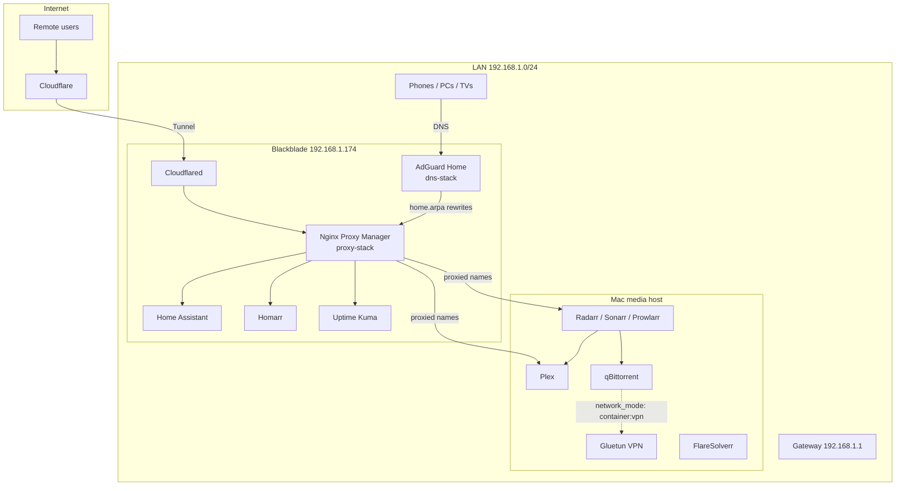

# Rowdy Roost Homelab

Configuration source of truth for the Rowdy Roost home lab: Docker Compose stacks, production deploy scripts, and Renovate update policy.

This repository does **not** store secrets, runtime app data, or media files. Those live on the hosts under `~/docker` and related paths. Use `.env.example` files as templates for secrets that stay only on the machines.

## What this is

A two-host homelab:

| Host | Role | Stacks in this repo |
|------|------|---------------------|
| **Blackblade** | LAN infrastructure: DNS, reverse proxy, home automation, dashboard, monitoring, Cloudflare Tunnel | `dns-stack`, `proxy-stack`, `infra-stack` |
| **Mac media host** | Media acquisition and playback | `plex-stack` |

Scripts assume a checked-out clone at `~/rowdyroost` and live Compose directories at `~/docker/<stack>` on the host you are deploying.

## High-level architecture



**Request path (LAN):** device asks AdGuard for a `*.home.arpa` name → AdGuard answers with Blackblade’s IP → browser hits Nginx Proxy Manager on ports 80/443 → NPM forwards to the right container or host.

**Request path (remote Home Assistant):** browser opens `https://hq.therowdyroost.com` → Cloudflare → `cloudflared` on Blackblade → (typically) NPM / Home Assistant. See [NETWORKING.md](docs/NETWORKING.md).

## Repository layout

```
rowdyroost/
├── dns-stack/          # AdGuard Home (Blackblade)
├── proxy-stack/        # Nginx Proxy Manager (Blackblade)
├── infra-stack/        # Home Assistant, Homarr, Uptime Kuma, Cloudflared (Blackblade)
├── plex-stack/         # Gluetun, qBittorrent, Plex, *arr, FlareSolverr (Mac)
├── scripts/            # backup / deploy / healthcheck / rollback
├── docs/               # This handbook
└── renovate.json       # Conservative image update policy
```

## Documentation

| Document | Contents |
|----------|----------|
| [ARCHITECTURE.md](docs/ARCHITECTURE.md) | Hosts, stacks, Git as source of truth, deploy model |
| [CONTAINERS.md](docs/CONTAINERS.md) | Every container: ports, mounts, dependencies, health |
| [MEDIA-PIPELINE.md](docs/MEDIA-PIPELINE.md) | Download → import → Plex lifecycle and hardlinks |
| [NETWORKING.md](docs/NETWORKING.md) | DNS, home.arpa, NPM, tunnel, VPN, Docker networking |
| [DEPLOYMENTS.md](docs/DEPLOYMENTS.md) | Renovate → review → deploy → health → rollback |
| [BACKUP-AND-RECOVERY.md](docs/BACKUP-AND-RECOVERY.md) | What is backed up, restore, disaster recovery |
| [SCRIPTS.md](docs/SCRIPTS.md) | Design and usage of the four production scripts |
| [TEACHING-GUIDE.md](docs/TEACHING-GUIDE.md) | Progressive lessons for teaching a teenager |
| [TROUBLESHOOTING.md](docs/TROUBLESHOOTING.md) | Symptom-based recovery guides |
| [GLOSSARY.md](docs/GLOSSARY.md) | Terms used throughout the handbook |

## Safe quick start

Run these on the **host that owns the stack** (Blackblade for infra stacks, Mac for `plex-stack`). Do not invent hosts or skip health checks.

### Check a stack is healthy

```bash
~/rowdyroost/scripts/healthcheck-stack.sh dns-stack
~/rowdyroost/scripts/healthcheck-stack.sh infra-stack
~/rowdyroost/scripts/healthcheck-stack.sh proxy-stack
~/rowdyroost/scripts/healthcheck-stack.sh plex-stack
```

### Deploy an approved Compose change

1. Merge the change on GitHub (usually via a Renovate PR).
2. On the target host: `cd ~/rowdyroost && git pull`
3. Deploy one stack at a time:

```bash
~/rowdyroost/scripts/deploy-stack.sh proxy-stack
```

`deploy-stack.sh` refuses to deploy if the stack is already unhealthy, takes a backup first, pulls images, brings the stack up, health-checks, and **automatically rolls back** if post-deploy checks fail.

### Manual backup or rollback

```bash
~/rowdyroost/scripts/backup-stack.sh plex-stack
~/rowdyroost/scripts/rollback-stack.sh plex-stack latest
```

Manual rollback asks you to type `ROLLBACK` before continuing.

### Secrets

Never commit `.env` files. On each host, keep secrets next to the **live** stack under `~/docker/<stack>/.env`. Templates:

- `plex-stack/.env.example` — `${WIREGUARD_PRIVATE_KEY}`
- Infra secrets (not exemplified in-repo beyond Compose references): `${CLOUDFLARED_TOKEN}`, `${HOMARR_SECRET_ENCRYPTION_KEY}`

See [Why secrets stay out of Git](docs/ARCHITECTURE.md#secrets-stay-out-of-git).

## Network facts used by this repo

| Item | Value in repo | Notes |
|------|---------------|--------|
| LAN | `192.168.1.0/24` | README / docs |
| Gateway | `192.168.1.1` | README / docs |
| Blackblade | `192.168.1.174` | Health checks, Uptime Kuma DNS, Renovate “Blackblade” groups |
| Mac media host | `192.168.1.36` | Older README/docs called this “Server”; hostname observed as `Mac.home.arpa` |
| Internal domain | `home.arpa` | AdGuard rewrites |

> **Needs clarification:** older docs labeled `192.168.1.36` as “the server.” Production health checks and Renovate treat Blackblade as `192.168.1.174` for DNS/NPM. Treat `192.168.1.174` as Blackblade and `192.168.1.36` as the Mac unless you update the scripts.

## Design principles

1. **Git is the approved Compose source** — live `~/docker/*/docker-compose.*` is overwritten from this repo by deploy scripts.
2. **Pin images** — version tags plus SHA256 digests (see Renovate `docker:pinDigests`).
3. **Backup before change** — every deploy creates a timestamped backup under `~/docker-backups/<stack>/`.
4. **Prove health after change** — scripted checks; failed deploy triggers automatic rollback.
5. **Separate infrastructure from media** — Blackblade stays up for DNS/proxy even if media downloads are down.
