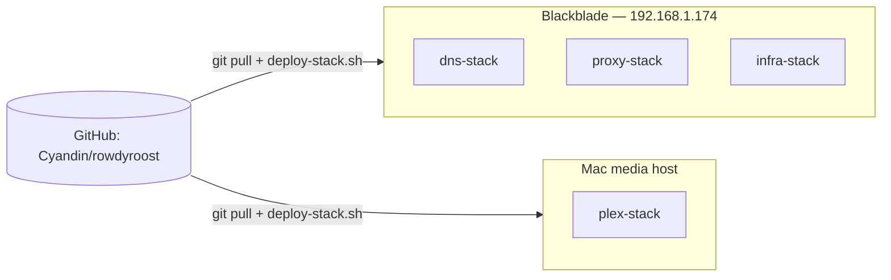
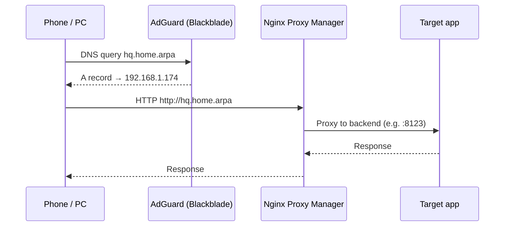
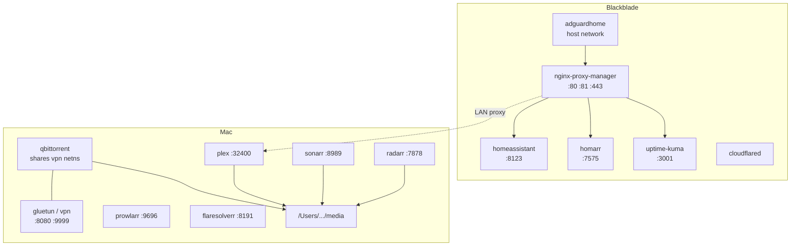
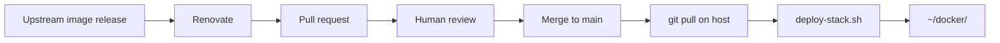
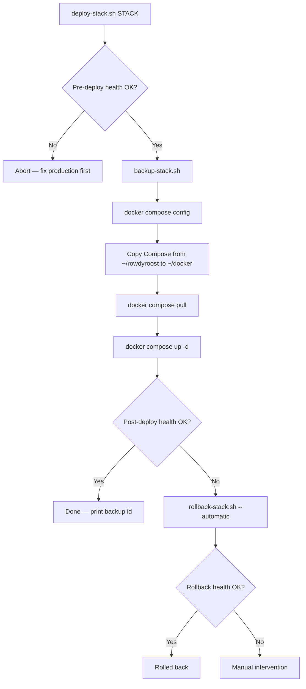

# Architecture

This document describes how the Rowdy Roost homelab is put together: hosts, stacks, DNS, reverse proxying, Git as source of truth, and the deploy / backup / rollback loop.

Related: [NETWORKING.md](NETWORKING.md) · [CONTAINERS.md](CONTAINERS.md) · [DEPLOYMENTS.md](DEPLOYMENTS.md) · [SCRIPTS.md](SCRIPTS.md)

## Two hosts, two jobs

| Host | Evidence in this repo | Runs |
|------|----------------------|------|
| **Blackblade** (`192.168.1.174`) | Renovate group “blackblade production patch updates” for `dns-stack/**`, `infra-stack/**`, `proxy-stack/**`; health checks target `192.168.1.174` for DNS, NPM, and `*.home.arpa` | AdGuard, NPM, Home Assistant, Homarr, Uptime Kuma, Cloudflared |
| **Mac media host** | `plex-stack` uses `/Users/costagalazios/...` bind mounts; health checks use `127.0.0.1`; commit history describes “Mac media stack” | Gluetun, qBittorrent, Plex, Radarr, Sonarr, Prowlarr, FlareSolverr |

> **Needs clarification:** Blackblade’s OS, exact hostname, and hardware are not recorded in this repository. Only the IP and stack ownership are evidenced.

### Why split infrastructure and media?

- **DNS and reverse proxy must stay up** even when torrents or Plex are broken. Families still need `home.arpa` names and Home Assistant.
- **Media I/O is heavy** (disk, VPN, downloads). Isolating it on the Mac keeps Blackblade lean.
- **Different risk profiles.** A bad media image update should not take down LAN DNS.

## Stacks

| Stack | Compose file | Host | Services (Compose service / container names) |
|-------|--------------|------|-----------------------------------------------|
| `dns-stack` | `docker-compose.yaml` | Blackblade | `adguardhome` / `adguardhome` |
| `proxy-stack` | `docker-compose.yaml` | Blackblade | `nginx-proxy-manager` / `nginx-proxy-manager` |
| `infra-stack` | `docker-compose.yaml` | Blackblade | `homeassistant`, `cloudflared`, `homarr`, `uptime-kuma` |
| `plex-stack` | `docker-compose.yml` | Mac | `gluetun`→`vpn`, `qbittorrent`, `plex`, `radarr`, `sonarr`, `prowlarr`, `flaresolverr` |

Live production copies live at `~/docker/<stack>/` on each host. The Git clone lives at `~/rowdyroost`. Deploy scripts copy **only the Compose file** from the repo into `~/docker/<stack>/`; runtime data stays on the host.

## Path from LAN client to an app

Layers (see [NETWORKING.md](NETWORKING.md) for definitions):

1. **LAN** — `192.168.1.0/24`, gateway `192.168.1.1`.
2. **DNS** — AdGuard Home (`network_mode: host`) answers queries; `home.arpa` rewrites point friendly names at Blackblade.
3. **Reverse proxy** — NPM listens on `80` / `443` (admin UI on `81`) and routes hostnames to backends.
4. **Apps** — containers on Blackblade or proxied to the Mac (for example Plex). Exact NPM proxy host/port mappings are **runtime config** in NPM’s data directory, not in Git.

### Remote access path (Home Assistant)

Health checks assert external reachability of `https://hq.therowdyroost.com`. That path uses:

1. Cloudflare edge
2. `cloudflared` container (`tunnel ... run --token ${CLOUDFLARED_TOKEN}`)
3. Local services on Blackblade (typically via NPM — **needs clarification:** exact Cloudflare Tunnel ingress hostname → origin mapping is configured in Cloudflare / tunnel config, not in this repo)

## Host layout diagram

## GitHub as configuration source of truth

- **In Git:** Compose definitions, scripts, Renovate policy, documentation.
- **Not in Git:** `.env` secrets, AdGuard/NPM/HA databases, Homarr/Uptime Kuma data, Plex libraries, downloads, Let’s Encrypt material (ignored via `.gitignore`).
- **Approved change** means: merged to `main`, then `deploy-stack.sh` copies that Compose file to the live directory and applies it.

See [DEPLOYMENTS.md](DEPLOYMENTS.md).

## Deployment, health, backup, rollback model

| Phase | Script | Intent |
|-------|--------|--------|
| Verify current state | `healthcheck-stack.sh` | Never deploy on top of a broken stack |
| Snapshot | `backup-stack.sh` | Capture Compose, image IDs, and stack appdata |
| Apply | `deploy-stack.sh` | Sync Git Compose → pull → up |
| Prove | `healthcheck-stack.sh` | Stack-specific HTTP/DNS/container checks |
| Recover | `rollback-stack.sh` | Restore backup Compose + data; pull + up; re-check |

Details: [SCRIPTS.md](SCRIPTS.md), [BACKUP-AND-RECOVERY.md](BACKUP-AND-RECOVERY.md).

## Secrets stay out of Git

Secrets referenced by Compose:

| Variable | Used by | Example file |
|----------|---------|--------------|
| `${WIREGUARD_PRIVATE_KEY}` | Gluetun (Surfshark WireGuard) | `plex-stack/.env.example` |
| `${CLOUDFLARED_TOKEN}` | Cloudflared tunnel | Live `~/docker/infra-stack/.env` (not in Git) |
| `${HOMARR_SECRET_ENCRYPTION_KEY}` | Homarr | Live `~/docker/infra-stack/.env` (not in Git) |

**Why Git must not contain secrets**

1. This repo is on GitHub; history is durable and often cloned.
2. Accidental exposure of WireGuard keys or tunnel tokens lets strangers use your VPN or tunnel.
3. `.gitignore` excludes `.env` and runtime data; backups under `~/docker-backups` are local and mode `go-rwx` after backup.

Always refer to secrets symbolically in docs and issues: `${WIREGUARD_PRIVATE_KEY}`, never paste real values.

## Known gaps / needs clarification

| Topic | Status |
|-------|--------|
| Exact NPM proxy rules (hostname → IP:port) | Runtime only in `proxy-stack` data |
| AdGuard rewrite table | Runtime only in AdGuard conf (repo has empty placeholder dirs) |
| Cloudflare Tunnel ingress routes | Outside this repo |
| Whether media `*.home.arpa` names proxy to the Mac’s LAN IP | Health check proves `plex.home.arpa` via NPM on Blackblade; backend target not in Git |
| `website.home.arpa` | Mentioned in older architecture notes; website is a separate project, not a container in this repo |
| Blackblade OS / hostname | Not documented here |
