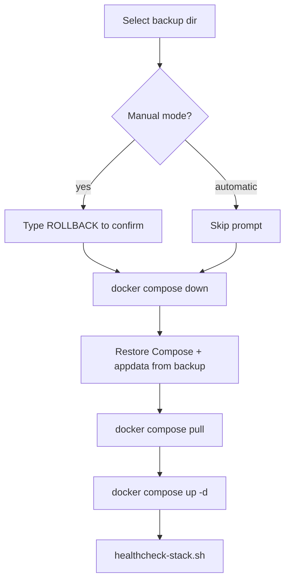

# Backup and recovery

What is saved, what is not, where it lives, and how rollback works.

Related: [SCRIPTS.md](SCRIPTS.md) · [DEPLOYMENTS.md](DEPLOYMENTS.md) · [ARCHITECTURE.md](ARCHITECTURE.md)

## Where backups live

```text
~/docker-backups/
  <stack>/
    <YYYYMMDD-HHMMSS>/
      ...
```

Created by `backup-stack.sh`. After copy, permissions are tightened with `chmod -R go-rwx` (and non–plex-stack backups are `chown`’d to the deploying user).

**Never commit backups to Git.** They can contain `.env` secrets and live databases.

## What each stack backup contains

Every stack backup also captures operational metadata:

- `compose-resolved.yaml` — fully resolved Compose config
- `images.txt` — image references
- `compose-ps.txt` / `docker-containers.txt` / `image-state.txt` — running container and digest evidence

### dns-stack

| Included | Path in backup |
|----------|----------------|
| Compose file | `docker-compose.yaml` |
| AdGuard data | `adguard/` (work + conf) |

Uses `sudo` to copy AdGuard files.

### infra-stack

| Included | Path in backup |
|----------|----------------|
| Compose | `docker-compose.yaml` |
| Secrets file if present | `.env` |
| Home Assistant | `homeassistant/` |
| Homarr | `homarr/` |
| Uptime Kuma | `uptime-kuma/` |

**Not included:** Cloudflared has no local volume in Compose (token is in `.env` if you keep it there).

Uses `sudo` for appdata trees.

### proxy-stack

| Included | Path in backup |
|----------|----------------|
| Compose | `docker-compose.yaml` |
| NPM data | `data/` |
| Certificates tree | `letsencrypt/` |

Uses `sudo`.

### plex-stack

| Included | Path in backup |
|----------|----------------|
| Compose | `docker-compose.yml` |
| Secrets if present | `.env` |
| Appdata dirs under `~/docker/appdata/` | `gluetun`, `qbittorrent`, `plex`, `radarr`, `sonarr`, `prowlarr` (each if present) |

No `sudo` (macOS-friendly). FlareSolverr has no persistent appdata in Compose.

## What media is **not** backed up

These are excluded by design (also listed in `.gitignore` patterns conceptually):

- `/Users/costagalazios/media` (movies, TV, downloads)
- Large media libraries generally

**Implication:** rollback restores **apps and configs**, not your film collection. Media needs a separate backup strategy (Time Machine, NAS sync, etc.) — **needs clarification** if you already have one outside this repo.

## How rollback works

`rollback-stack.sh <stack> [backup-id|latest] [manual|--automatic]`



Automatic mode is used by `deploy-stack.sh` when post-deploy health fails.

### Per-stack restore actions

| Stack | Restore behavior |
|-------|------------------|
| dns-stack | Replace `adguard/`; restore Compose |
| infra-stack | Replace `homeassistant/`, `homarr/`, `uptime-kuma/`; restore Compose + `.env` if backed up |
| proxy-stack | Replace `data/` + `letsencrypt/`; restore Compose |
| plex-stack | Replace listed appdata dirs under `~/docker/appdata/`; restore Compose + `.env` |

## Database migrations and rollback risk

Restoring **old app data** onto a **newer image** (or the reverse) can fail when apps migrate schemas forward only.

| Safer | Riskier |
|-------|---------|
| Rollback soon after a bad deploy, using the backup taken **immediately before** that deploy | Restoring a weeks-old backup onto today’s image after many migrations |
| Keeping Compose + data pairs from the same backup together | Mixing old data with a new unrelated Compose digest |
| Preferring patch/digest updates with 7-day soak | Jumping majors without a tested downgrade path |

If health checks fail after rollback, the script exits non-zero with `ROLLBACK COMPLETED BUT HEALTH CHECK FAILED` — you must intervene manually (see [TROUBLESHOOTING.md](TROUBLESHOOTING.md#a-rollback-fails)).

## Manual restore examples

```bash
# List backups
ls ~/docker-backups/plex-stack

# Restore latest
~/rowdyroost/scripts/rollback-stack.sh plex-stack latest

# Restore a specific id
~/rowdyroost/scripts/rollback-stack.sh infra-stack 20260717-190501
```

## Disaster recovery principles

1. **Config in Git, state in backups, media separate.** Rebuilding a host means: install Docker → clone `rowdyroost` → restore `~/docker` + `~/docker-backups` artifacts → place `.env` secrets → `docker compose up`.
2. **Test restores** on a non-critical stack before you need them.
3. **Secrets:** `.env` inside backups is sensitive; store backup disks accordingly.
4. **DNS first:** if Blackblade is dead, restore `dns-stack` / `proxy-stack` before worrying about Plex.
5. **Do not assume media is in `docker-backups`.** It is not.

## Needs clarification

- Offsite / encrypted backup of `~/docker-backups`
- Media library backup policy
- How Blackblade’s disk is snapshotted (if at all) outside these scripts
