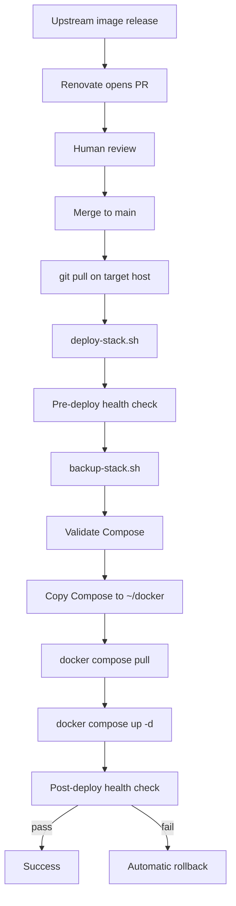

# Deployments

Production update model: from upstream image release to a healthy stack on Blackblade or the Mac.

Related: [ARCHITECTURE.md](ARCHITECTURE.md) · [SCRIPTS.md](SCRIPTS.md) · [BACKUP-AND-RECOVERY.md](BACKUP-AND-RECOVERY.md) · [renovate.json](../renovate.json)

## End-to-end flow



### Human checklist

1. Read the Renovate PR (changelog, digest change, which stack).
2. Merge only when you are ready to deploy that host.
3. On the **correct host** (Blackblade vs Mac):

```bash
cd ~/rowdyroost && git pull
~/rowdyroost/scripts/deploy-stack.sh <stack>
```

Valid `<stack>` values: `dns-stack` | `infra-stack` | `proxy-stack` | `plex-stack`.

## Renovate policy (what GitHub automation does)

Configured in `renovate.json`:

| Rule | Intent |
|------|--------|
| `config:recommended` + `docker:pinDigests` | Track Docker deps and pin SHA256 digests |
| `automerge: false` (global and Docker) | **Humans** merge production image changes |
| `minimumReleaseAge: "7 days"` for Docker | Avoid brand-new tags; wait a week |
| Docker **major** updates `enabled: false` | Majors are not auto-proposed |
| Group patch+digest for Blackblade stacks | Fewer noisy PRs for dns/infra/proxy |
| Separate groups for HA, AdGuard, NPM | Review critical infra alone |
| Homarr: disable major/minor/patch while on `latest` | Digest-only vigilance; no auto version churn |
| Uptime Kuma: majors disabled | Avoid cross-major migrations |
| `plex-stack/**`: no automerge, 7-day age | Media stack always manual |

## Semantic version tags + SHA256 digests

Example from Compose (pattern, not a secret):

```text
adguard/adguardhome:v0.107.78@sha256:1ea34eafe5dc6910...
```

| Piece | Role |
|-------|------|
| Tag (`v0.107.78`, `2026.7.2`, `1.23.17`, …) | Human-readable version intent |
| `@sha256:…` digest | **Immutable** content address of the image |

Docker resolves the digest. Even if someone retags `v0.107.78` on the registry tomorrow, a digest-pinned Compose file still pulls the bits you reviewed.

Some media images use `latest@sha256:…`. The tag is mutable in name only; the **digest** still pins content. Renovate updates the digest when the tag moves (subject to rules above).

Gluetun is pinned **digest-only** (`qmcgaw/gluetun@sha256:…`) with no floating semver tag in Compose.

### Why mutable `latest` without a digest is risky

1. `docker compose pull` on Monday and Friday can get **different images** with the same Compose line.
2. Incidents become unreproducible (“what exact image was running?”).
3. Automatic rollouts can yank a broken build onto production without a PR.

This lab pins digests so “what we merged” equals “what we run.”

### Why majors are conservative

Major upgrades often include:

- Breaking config changes
- Database migrations that are hard to reverse
- UI/API changes that break NPM paths or integrations

Renovate disables Docker majors globally and further restricts Homarr / Uptime Kuma. When you *do* take a major, plan a maintenance window, ensure a fresh backup, and read upstream upgrade notes.

## What `deploy-stack.sh` guarantees

| Guarantee | Behavior |
|-----------|----------|
| Refuse dirty baselines | Aborts if pre-deploy healthcheck fails |
| Backup first | Calls `backup-stack.sh` and records backup id |
| Validate | `docker compose config` (with live `.env` for `infra-stack` / `plex-stack` when present) |
| Sync from Git | Copies Compose from `~/rowdyroost/<stack>/` → `~/docker/<stack>/` |
| Pull + up | Uses the live directory |
| Verify | Post healthcheck |
| Auto-heal attempt | On failure, `rollback-stack.sh <stack> <backup-id> --automatic` |

Deploy does **not** `git pull` for you — pull first.

## Per-host reminder

| Stack | Deploy on |
|-------|-----------|
| `dns-stack`, `proxy-stack`, `infra-stack` | Blackblade |
| `plex-stack` | Mac media host |

Paths assumed: `REPO_ROOT=$HOME/rowdyroost`, `DOCKER_ROOT=$HOME/docker`, `BACKUP_ROOT=$HOME/docker-backups`.
