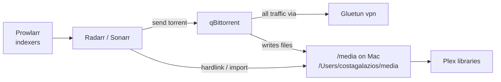

# Media pipeline

How a movie or TV episode moves from “I want this” to “it’s in Plex,” using only what `plex-stack` defines.

Related: [CONTAINERS.md](CONTAINERS.md) · [NETWORKING.md](NETWORKING.md) · [TROUBLESHOOTING.md](TROUBLESHOOTING.md)

## Lifecycle overview



| Step | Who | What happens |
|------|-----|----------------|
| 1 | **Prowlarr** | Knows torrent indexers; syncs them to Radarr/Sonarr |
| 2 | **Radarr** (movies) or **Sonarr** (TV) | Searches indexers, picks a release, hands it to the download client |
| 3 | **qBittorrent** | Downloads the torrent |
| 4 | **Gluetun (`vpn`)** | Provides qBittorrent’s entire network namespace (VPN path) |
| 5 | **Shared `/media` volume** | Completed download lands under the Mac path mounted as `/media` |
| 6 | **Radarr/Sonarr import** | Prefer **hardlink** into the library folder on the same filesystem |
| 7 | **Plex** | Sees the library files under the same `/media` mount and plays them |

Indexer credentials, category names, and exact folder roots (for example `movies/` vs `downloads/`) are configured inside the apps, not in Git. On the Mac host, `/Users/costagalazios/media` currently contains folders such as `downloads`, `movies`, `tv`, and age-split libraries — treat those as operational layout, not Compose-defined paths beyond the single `/media` bind.

**FlareSolverr** sits beside this path: Prowlarr may call it when an indexer needs browser-challenge solving. It does not touch the video files.

## Why qBittorrent shares Gluetun’s network namespace

In Compose:

```yaml
qbittorrent:
  network_mode: container:vpn
  depends_on:
    - gluetun
```

And Gluetun publishes:

```yaml
ports:
  - "8080:8080" # qBittorrent Web UI
  - "9999:9999" # Gluetun health endpoint
```

**Meaning**

1. qBittorrent has **no independent network stack**. Every packet (peers, trackers, Web UI) goes through the `vpn` container.
2. If the VPN is down, qBittorrent cannot quietly fall back to your home IP — it shares the VPN’s network (and Gluetun’s firewall behavior).
3. You reach the Web UI at the **host** address `http://127.0.0.1:8080` because ports are published on **Gluetun**, not on qBittorrent.
4. `FIREWALL_OUTBOUND_SUBNETS=192.168.0.0/16,10.0.0.0/8` allows Gluetun to talk to private LAN ranges so local apps (Radarr/Sonarr on the Mac) can still reach the Web UI while torrent traffic uses the VPN.

**Teaching analogy:** Gluetun is a sealed hallway to the internet. qBittorrent lives only inside that hallway. Radarr knocks on the hallway door (`:8080`) from inside the house.

## Hardlinks (and why disk usage should not double)

### What a hardlink is

On the same filesystem, a **hardlink** is a second directory entry pointing at the **same inode** (same bytes on disk).

```text
downloads/Some.Movie.mkv  ──┐
                            ├──► same file data (one copy on disk)
movies/Some Movie (2024)/Some Movie.mkv ──┘
```

Contrast with a **copy**: two inodes, two full copies → roughly **2× disk**.

### Why the *arr stack cares

Radarr/Sonarr typically:

1. Let qBittorrent finish in a download folder.
2. **Hardlink** (or move) into the library folder Plex watches.
3. Keep seeding from the download path while Plex reads the library path — **without paying for a second copy**, if hardlinks work.

Compose enables this by mounting **one** host tree into every media container:

| Container | Mount |
|-----------|--------|
| qBittorrent | `/Users/costagalazios/media` → `/media` |
| Radarr | same |
| Sonarr | same |
| Plex | same |

All four must see the **same filesystem path layout** inside the containers. If downloads lived on disk A and the library on disk B, hardlinks would be impossible and imports would copy (or fail).

### “Disk usage unexpectedly doubles”

Usually means imports are **copying** instead of hardlinking:

- Download and library paths are on different volumes/drives.
- Paths inside Radarr/Sonarr don’t match how qBittorrent wrote files (remote path mapping mismatch).
- Atomic move/copy settings force a copy.

See [TROUBLESHOOTING.md](TROUBLESHOOTING.md#disk-usage-unexpectedly-doubles).

## What this repo does *not* encode

These are real, but configured in app UIs / host layout — mark as operational, not Git:

- Exact qBittorrent save paths and categories
- Radarr/Sonarr root folders and quality profiles
- Plex library folder selections
- Which indexers Prowlarr uses
- Whether Usenet is used (Compose only shows a torrent client)

## Failure points mapped to symptoms

| Break | Symptom |
|-------|---------|
| Prowlarr down / indexers fail | Searches return nothing |
| FlareSolverr down | Challenge-protected indexers fail |
| Gluetun unhealthy | qBittorrent cannot reach internet; healthcheck VPN egress fails |
| qBittorrent down | *arr apps show download client errors |
| `/media` permissions (`PUID=501` / `PGID=20`) | Downloads or imports fail with permission errors |
| Hardlink path mismatch | Imports copy or fail; disk doubles |
| Plex down | Files exist but nothing plays |

Health entry point: `~/rowdyroost/scripts/healthcheck-stack.sh plex-stack`.
