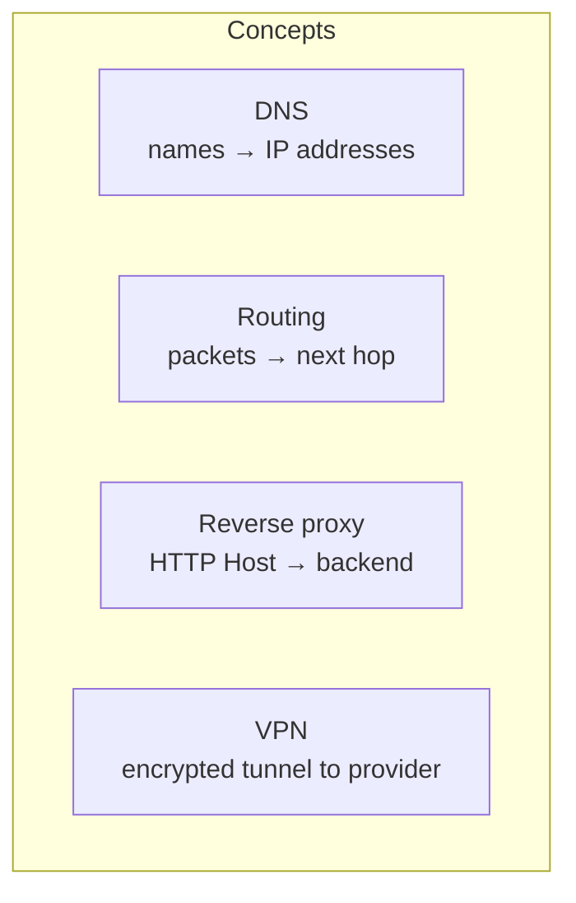

# Networking

DNS, reverse proxies, tunnels, Docker networking, and VPN — and how they differ.

Related: [ARCHITECTURE.md](ARCHITECTURE.md) · [CONTAINERS.md](CONTAINERS.md) · [GLOSSARY.md](GLOSSARY.md)

## Big picture



| Concept | Question it answers | Example here |
|---------|---------------------|--------------|
| **DNS** | “What IP is `hq.home.arpa`?” | AdGuard Home |
| **Routing** | “How do packets reach that IP on the LAN?” | Your switch/router (`192.168.1.1`) |
| **Reverse proxy** | “This HTTP request for Host X goes to which app?” | Nginx Proxy Manager |
| **VPN** | “Should *this container’s* internet traffic look like it comes from elsewhere?” | Gluetun + Surfshark WireGuard |

They stack; they do not replace each other. Broken DNS with a healthy proxy still looks like “the internet is down.”

## LAN facts in this repository

| Item | Value | Where |
|------|-------|--------|
| LAN | `192.168.1.0/24` | README |
| Gateway | `192.168.1.1` | README |
| Blackblade | `192.168.1.174` | Health checks, Uptime Kuma `dns:`, Renovate “Blackblade” groups |
| Mac media host | `192.168.1.36` | Older docs; Mac hostname `Mac.home.arpa` observed operationally |
| Internal domain | `home.arpa` | README / architecture |

DHCP “use AdGuard as DNS” is configured on the router — **not in this repo** (needs clarification if you document router settings elsewhere).

## LAN DNS and AdGuard

AdGuard runs with `network_mode: host` on Blackblade so it can bind DNS ports on the host itself.

Health checks:

```bash
dig @192.168.1.174 example.com +short
curl -fsS http://192.168.1.174:8002 >/dev/null
```

**Job:** resolve public names (via upstream resolvers configured in AdGuard — runtime) and rewrite internal names under `home.arpa`.

### home.arpa

`home.arpa` is the reserved special-use domain for home networks. Friendly names used in health checks / older docs include:

| Name | Purpose (from health checks / docs) |
|------|-------------------------------------|
| `hq.home.arpa` | Home Assistant via NPM |
| `homarr.home.arpa` | Homarr via NPM |
| `status.home.arpa` | Uptime Kuma via NPM |
| `npm.home.arpa` | NPM admin via NPM |
| `plex.home.arpa` | Plex via NPM |
| `adguard.home.arpa` | Documented rewrite target (UI often also on `:8002`) |
| `radarr.home.arpa`, `sonarr.home.arpa`, `prowlarr.home.arpa`, `qbittorrent.home.arpa` | Documented in older architecture notes |
| `website.home.arpa` | Separate website project — **not** a container in this repo |

Exact AdGuard rewrite records are **runtime data**, not stored in Git.

### DNS dependencies

- Clients must use AdGuard (or somehow resolve `home.arpa`) or names fail.
- Uptime Kuma container DNS: `192.168.1.174` then `1.1.1.1`.
- Gluetun uses `DNS_ADDRESS=9.9.9.9` with `DOT=off` for VPN-side DNS (separate from LAN AdGuard).

## Nginx Proxy Manager and reverse proxies

NPM publishes:

| Host port | Role |
|-----------|------|
| 80 | HTTP |
| 443 | HTTPS |
| 81 | Admin UI |

Volumes: `./data`, `./letsencrypt`.

A **reverse proxy** accepts a browser request and forwards it to a backend. The browser only talks to NPM; NPM talks to Home Assistant, the Mac’s Plex port, etc.

Health checks force resolution to Blackblade while testing:

```bash
curl --resolve npm.home.arpa:80:192.168.1.174 http://npm.home.arpa
curl --resolve hq.home.arpa:80:192.168.1.174 http://hq.home.arpa
curl --resolve plex.home.arpa:80:192.168.1.174 http://plex.home.arpa
```

Proxy host definitions live in NPM’s data directory (backed up with `proxy-stack`), not in Compose YAML.

## Cloudflare Tunnel

`cloudflared` runs:

```text
tunnel --no-autoupdate --protocol http2 run --token ${CLOUDFLARED_TOKEN}
```

- No inbound router port forward required for the tunnel.
- Infra health check verifies `https://hq.therowdyroost.com`.
- Ingress (which public hostname maps to which local origin) is configured in Cloudflare — **needs clarification / not in Git**.

## Docker networks, host networking, published ports

| Mode | Used by | Meaning |
|------|---------|---------|
| **Host networking** | AdGuard | Container shares the host’s network namespace; no `ports:` mapping |
| **Published ports** | NPM, HA, Homarr, Uptime Kuma, Plex, *arr, FlareSolverr, Gluetun | `hostPort:containerPort` on the Docker host |
| **Share another container’s network** | qBittorrent → `container:vpn` | No own IP/ports; uses Gluetun’s stack; ports must be published on Gluetun |

Default Compose bridge networks are used where not overridden. This repo does not define custom named external networks in the Compose files.

## VPN networking (Gluetun)

- Provider: Surfshark, type WireGuard.
- Container name: `vpn`.
- qBittorrent: `network_mode: container:vpn`.
- LAN access to private subnets allowed via `FIREWALL_OUTBOUND_SUBNETS`.
- Health: Docker health status, `http://127.0.0.1:9999`, and `docker exec vpn wget -qO- https://ipinfo.io/ip`.

VPN ≠ reverse proxy ≠ DNS. The VPN only encloses containers that use its network namespace (here: qBittorrent). Plex/Radarr/Sonarr use normal published ports on the Mac.

## Mental model cheat sheet

```text
Device
  │  DNS query
  ▼
AdGuard  ──►  "plex.home.arpa is 192.168.1.174"
  │
  │  HTTP Host: plex.home.arpa
  ▼
NPM on Blackblade  ──►  forwards to Plex backend (runtime rule)
  │
  ▼
Plex on Mac :32400

Meanwhile, separately:
qBittorrent packets ──► Gluetun WireGuard ──► Surfshark ──► Internet
```

## Needs clarification

- Router DHCP DNS settings
- Full AdGuard rewrite list
- Full NPM proxy table (especially Mac backend IPs/ports)
- Cloudflare Tunnel public hostname → origin map
- Whether HTTPS certificates for `home.arpa` are used on LAN or HTTP-only internally
